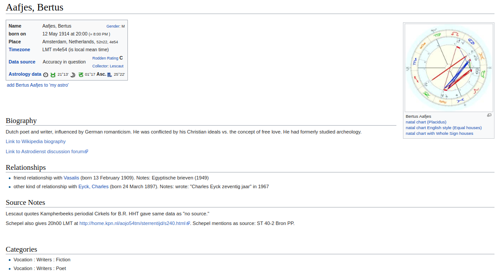
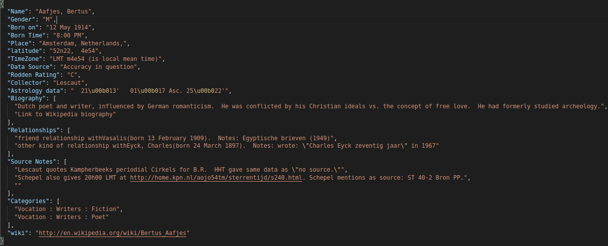

## Astrolgy Data
Data scraped from [Astro](https://www.astro.com/astro-databank) for Research

### Requirements
- Python 3.7
- beautifulsoup4

### Example
#### Website page of an data

#### Extracted the website data into json



### How to use the repository
- **full_data.zip** contains all the data available on the site
- For getting the data one by one
  ```
  $ python3 loopAllPage.py
  ```
- For getting the data using multi-threading
  ```
  $ python3 multiprocessAllpage.py

## Contributing
Pull requests are welcome. For major changes, please open an issue first to discuss what you would like to change. Please cite the repo, if you use in any publications.